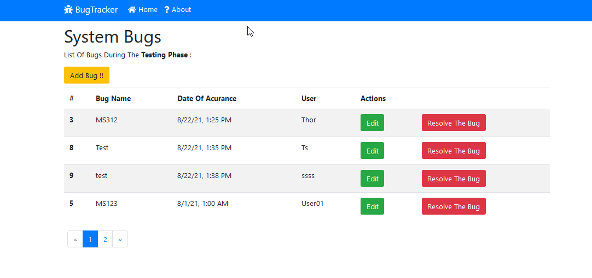
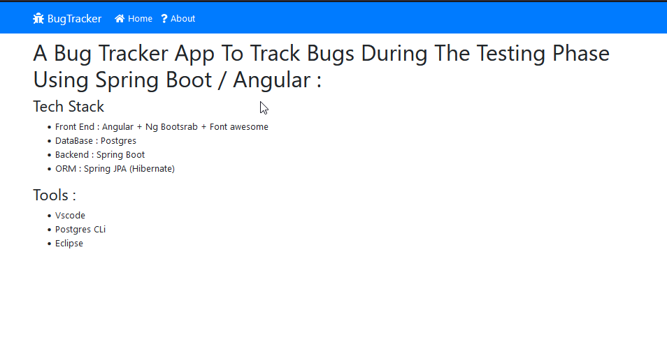

# A Bug Tracker App Using Angular && Spring Boot




---


## Description

- A Bug Tracker App To Track Bugs During The Testing Phase Using Spring Boot / Angular

#### Fonctionnalites

- Pagination
- CRUD Bugs
- Form Validation
- Looding (spinner)
- About Page

---

#### Technologies

- JAVA Spring Boot
- JavaScript / Type Script
- ng Boostrap

---

#### conf

- Install Node Modules <br>

```
cd frontend
npm install
```

- You Need To Create A Database In  
  Postgres Named DbBugTracker And Add The Password + UserName In application.properties

---

#### Run The App

- Run The Backend

```
cd  Bugtracker
.\mvnw.cmd spring-boot:run
```

- Run The Frontend

```
cd frontend
ng serve --open
```

#### Tools

- Vscode
- Eclipse
- Postgres CLi
